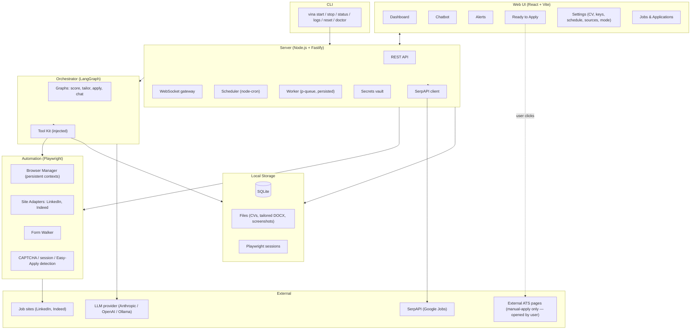

# Architecture

## 1. High-Level View

Vina is a single user-installed application made of five cooperating processes/modules running on the user's machine.

### Mermaid view



### ASCII view

```
                          ┌─────────────────────────────┐
                          │        User's browser       │
                          │   (web UI at localhost)     │
                          └──────────────┬──────────────┘
                                         │ HTTP + WebSocket
                                         ▼
   ┌──────────────────────────────────────────────────────────────────┐
   │                    Vina background service                       │
   │                       (Node.js, Fastify)                         │
   │                                                                  │
   │  ┌────────────┐  ┌────────────┐  ┌──────────────┐  ┌──────────┐ │
   │  │   HTTP /   │  │  Scheduler │  │ Orchestrator │  │   Data   │ │
   │  │ WebSocket  │◀▶│   (cron)   │◀▶│  (LangGraph) │◀▶│ (SQLite) │ │
   │  │   layer    │  │            │  │              │  │          │ │
   │  └────────────┘  └─────┬──────┘  └──────┬───────┘  └──────────┘ │
   │                        │                │                        │
   │                        ▼                ▼                        │
   │                 ┌─────────────────────────────┐                  │
   │                 │    Application worker       │                  │
   │                 │   (queues, retries, IPC)    │                  │
   │                 └──────┬───────────────┬──────┘                  │
   │                        │               │                         │
   │                        ▼               ▼                         │
   │             ┌─────────────────┐ ┌─────────────────┐              │
   │             │ Browser auto.   │ │ SerpAPI client  │              │
   │             │  (Playwright)   │ │ (Google Jobs)   │              │
   │             └────────┬────────┘ └────────┬────────┘              │
   └──────────────────────┼───────────────────┼──────────────────────-┘
                          │                   │
                          ▼                   ▼
                 LinkedIn, Indeed       SerpAPI → Google Jobs
                 (auto-apply +
                  manual-apply
                  detection)
```

Everything except the user's browser and the external services runs in a single Node.js process started by `vina start`. We do not run a separate worker process in MVP — the application worker is an in-process queue. This keeps installation simple and IPC trivial. We can split it out later if scheduling collides with HTTP latency. (See `decisions.md` ADR-010.)

## 2. Components

### 2.1 CLI (`packages/cli`)

Thin wrapper. Resolves the OS user-data directory, manages the daemon lifecycle (start/stop/status), opens the browser. See `cli-spec.md`.

### 2.2 Server (`packages/server`)

The Node.js process. Owns:

- Fastify HTTP server and WebSocket gateway
- SQLite connection (singleton, WAL mode)
- Scheduler (`node-cron` jobs that enqueue search runs)
- Application worker (in-process FIFO queue with concurrency limits)
- Settings and secrets vault (LLM keys, SerpAPI key)
- File storage for CVs, cover letters, and tailored output
- SerpAPI client for Google Jobs discovery

Talks to the orchestrator and automation packages through plain function calls — they are libraries, not separate services. The SerpAPI client lives in `services/` because it's an HTTP integration, not browser automation.

### 2.3 Orchestrator (`packages/orchestrator`)

A library exposing LangGraph graphs and the tools the LLM can call. Stateless; given a job + profile + a tool set, it runs a graph and returns the result. The tools it receives are bound to the current automation session and the current DB.

### 2.4 Automation (`packages/automation`)

Playwright wrapper. Owns persistent browser contexts (one per browser-kind site), site adapters (`LinkedInAdapter`, `IndeedAdapter`), DOM helpers, the screenshot/log machinery on failure, and the Easy Apply detection logic that decides whether a listing is auto-applyable. Pure functions — no DB access; returns structured results to the server. Does **not** include Google Jobs — that source uses an HTTP API, not browser automation, and lives in the server's `services/`.

### 2.5 Web (`packages/web`)

React app served as static files by Fastify under `/`. Talks to the API and subscribes to WebSocket events for live updates.

### 2.6 Shared (`packages/shared`)

Zod schemas, TypeScript types, error classes, constants. Imported by every other package.

## 3. Process Model

- **One Node process** for everything backend. Started by `vina start`, stopped by `vina stop`
- **Playwright spawns its own browser process(es)**, managed via the standard Playwright API
- The user's web browser is a regular browser tab, not orchestrated by Vina

The CLI uses a PID file in the user-data directory to track the running daemon. `vina status` reads it; `vina stop` sends SIGTERM and cleans up.

## 4. Key Flows

### 4.1 First-run onboarding

1. User runs `vina start`
2. CLI checks for existing daemon, starts one if absent
3. Server starts on a free port (default 7341, configurable), writes the URL to a status file
4. CLI opens `http://localhost:7341` in the user's default browser
5. Frontend detects no profile exists and shows the onboarding wizard
6. Wizard calls `POST /api/profile`, `POST /api/llm-providers`, `POST /api/cvs`, etc.
7. For LinkedIn / Indeed, frontend calls `POST /api/sites/{site}/login`. Server launches a Playwright browser in headful mode, navigates to the site's login page, waits for a successful-login signal (URL match or cookie presence), then closes the window and saves the storage state to disk
8. For Google Jobs, the user enters a SerpAPI key. The server validates it with a minimal call before saving. No login flow is required

### 4.2 Scheduled search

1. `node-cron` fires per the user's schedule
2. Scheduler enqueues a `search` task per enabled source (LinkedIn, Indeed, Google)
3. Worker picks up `search` tasks:
   - For LinkedIn and Indeed: instantiates the relevant Playwright adapter against the saved storage state. The adapter returns a list of raw listings; for each, it inspects whether it's Easy Apply or external and sets `apply_method` accordingly
   - For Google Jobs: calls SerpAPI's Google Jobs endpoint with the user's preferences. All returned listings are `apply_method = 'manual'` and capture the `external_apply_url` plus `original_source` (e.g. "Greenhouse", "Dice")
4. Worker writes new listings to the `jobs` table, deduplicating on `(site_id, external_id)`
5. Worker triggers a `score` task per new job; orchestrator's scoring graph runs and updates `match_score` and `match_justification`
6. WebSocket broadcasts `jobs:updated` so the UI refreshes

### 4.3 Auto-apply (LinkedIn / Indeed Easy Apply)

1. After scoring, if the user is in autonomous mode, worker enqueues an `apply` task for every job with `apply_method='auto'` and a score above threshold
2. Worker picks up `apply`, calls orchestrator's apply graph
3. The graph: loads profile and CV → tailors the CV → if review-first, sets application status to `awaiting_approval` and stops; otherwise calls automation's `apply_to_job` tool
4. `apply_to_job` opens the listing, walks the application form, and emits a sequence of events:
   - `field_filled` — known data populated
   - `field_unknown` — pauses, returns to graph; graph creates a missing-field alert and exits
   - `captcha_detected` — pauses, returns to graph; graph creates a captcha alert and exits
   - `submitted` — application complete

### 4.4 Manual-apply (Google Jobs and external LinkedIn / Indeed listings)

1. After scoring, the worker enqueues a `prepare_manual_apply` task for every job with `apply_method='manual'` that the user (or the autonomous mode) has selected
2. Worker picks up `prepare_manual_apply`, calls orchestrator's tailor-cv graph and (if a default cover letter is configured) the tailor-cover-letter graph
3. Application status transitions to `ready_for_manual_apply`. The tailored CV path, optional cover letter path, and `external_apply_url` are stored
4. An alert of kind `ready_for_manual_apply` is created
5. WebSocket emits `application:ready_for_manual_apply`
6. The "Ready to Apply" UI surfaces the application; the user reviews the tailored CV, downloads it, clicks the external link to apply, and clicks "Mark as applied"
7. `POST /api/applications/{id}/mark-applied` transitions the application to `applied_manually` and resolves the alert

### 4.5 Resume after user input

1. User answers the missing question (in chatbot or alerts tab)
2. Frontend posts to `POST /api/alerts/{id}/resolve` with the value
3. Server stores the value (in `profile_answers` if reusable) and re-enqueues the application's `apply` task with the updated context
4. Adapter resumes from the saved form state

## 5. Communication Patterns

| From           | To             | Mechanism                           |
| -------------- | -------------- | ----------------------------------- |
| Web UI         | Server         | HTTP REST + WebSocket               |
| Scheduler      | Worker         | In-process queue (`p-queue`)        |
| Worker         | Orchestrator   | Function call                       |
| Worker         | SerpAPI client | Function call (HTTP under the hood) |
| Orchestrator   | Automation     | Function call (passed in as tools)  |
| Orchestrator   | LLM provider   | HTTPS via LangChain provider        |
| Automation     | Job site       | Playwright over HTTPS               |
| SerpAPI client | SerpAPI        | HTTPS                               |

There is no inter-process IPC inside Vina. The only IPC is between the CLI and the daemon (PID file + signal-based stop, plus a tiny status file).

## 6. State and Storage

| Where                                              | What                                                 |
| -------------------------------------------------- | ---------------------------------------------------- |
| `~/<user-data>/vina/vina.db`                       | SQLite database                                      |
| `~/<user-data>/vina/files/cvs/`                    | Original uploaded CVs                                |
| `~/<user-data>/vina/files/tailored/`               | Tailored CV outputs, named `{application_id}.docx`   |
| `~/<user-data>/vina/files/cover-letters/`          | Original uploaded cover letters                      |
| `~/<user-data>/vina/files/tailored-cover-letters/` | Tailored cover letters                               |
| `~/<user-data>/vina/sessions/{site}/`              | Playwright `storageState` for each browser-kind site |
| `~/<user-data>/vina/screenshots/{application_id}/` | Failure screenshots                                  |
| `~/<user-data>/vina/logs/`                         | Rolling log files                                    |
| `~/<user-data>/vina/vina.pid`                      | Daemon PID                                           |
| `~/<user-data>/vina/vina.status`                   | JSON: port, started-at, version                      |

User-data directory resolution uses `env-paths` (Node library): macOS `~/Library/Application Support/vina`, Linux `~/.local/share/vina`, Windows `%APPDATA%\vina`.

Note: Google Jobs has no `sessions/google/` directory because there is no browser session — the SerpAPI key in `settings` is the only credential.

## 7. Concurrency Model

The application worker uses `p-queue` with named queues:

- `search` queue — concurrency 1 per source (so we don't double-search)
- `apply` queue — concurrency 1 globally for MVP (one auto-apply application at a time, simpler, less detection risk)
- `prepare_manual_apply` queue — concurrency 2 (these don't touch a browser, so we can run them in parallel; bounded only by LLM rate limits)

All queues survive the process — pending tasks are stored in a `task_queue` table and re-enqueued on startup. Failed tasks have exponential backoff with a max retry count.

## 8. Security

- API keys (LLM providers, SerpAPI) are encrypted at rest using a key derived from a machine-bound seed (e.g. `node-keytar` if available, falling back to a file with restrictive permissions)
- The HTTP server binds to `127.0.0.1` only
- Each session writes a per-process bearer token to `vina.status`; the frontend reads it from `/api/bootstrap` (served only to localhost) and includes it in subsequent requests. This is a defence-in-depth measure, not a primary security boundary
- All file paths are validated to stay inside the Vina data directory

## 9. Failure Handling

- Any uncaught exception in the worker logs and marks the current task as failed; the worker continues
- Playwright failures take a screenshot before throwing
- SerpAPI failures (rate limit, invalid key, timeout) are logged and the search task retries with backoff; if all retries fail, an alert is created prompting the user to check their SerpAPI configuration
- Network failures to the LLM provider trigger up to 3 retries with backoff; if all fail, the application is marked failed with reason `llm_unreachable` and an alert is created
- Database is opened in WAL mode; writes are inside transactions where atomicity matters (e.g. application status transitions)

## 10. Extension Points

- New browser-kind job site = new adapter implementing `SiteAdapter`. No other code changes needed
- New API-kind source (like SerpAPI for Google Jobs) = new service module under `server/services/`, register it as a `kind='api'` row in `sites`, wire it into the search task dispatcher
- New LLM provider = new entry in the provider registry; LangChain handles the rest
- New tool the agent can call = add to the orchestrator's tool registry; document in `langgraph-orchestrator.md`
